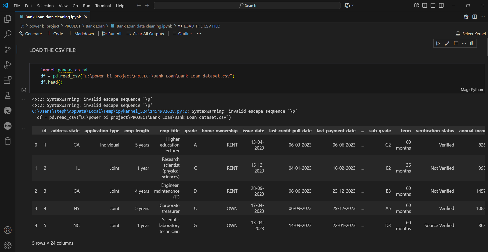
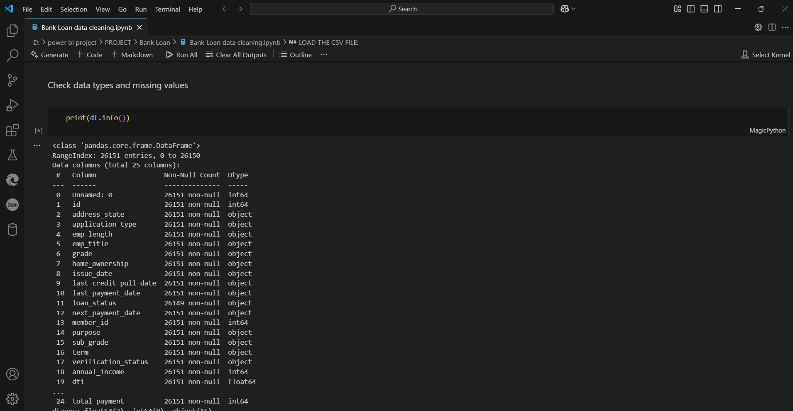
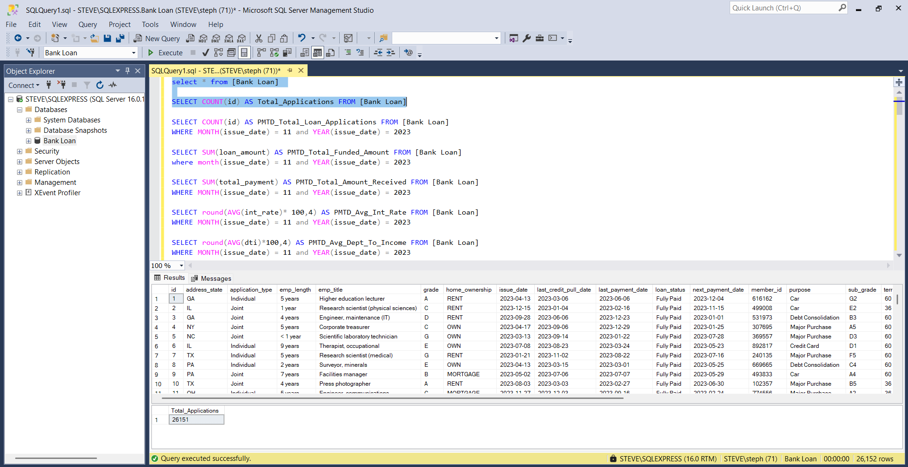
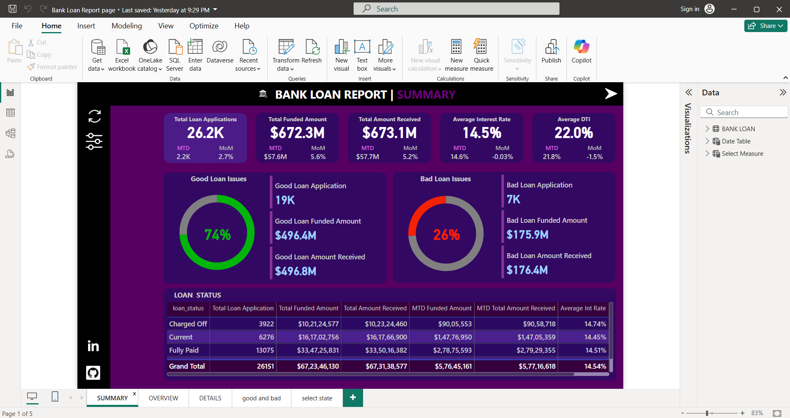
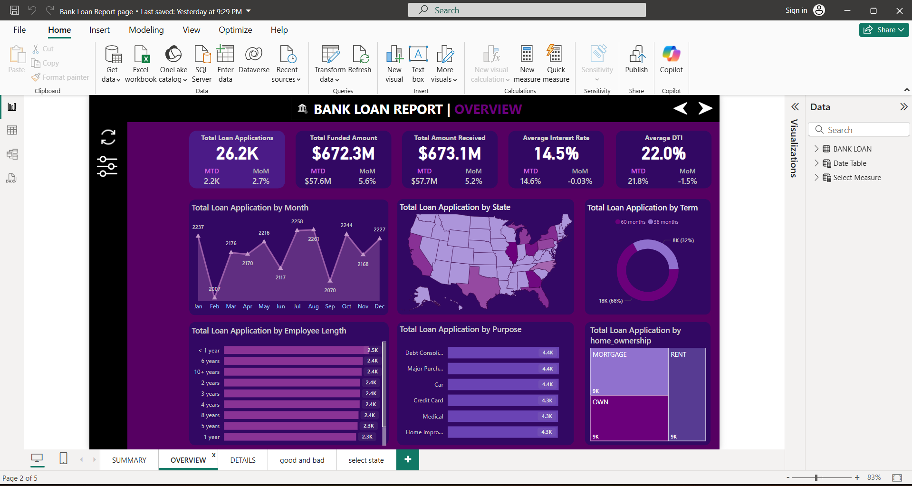
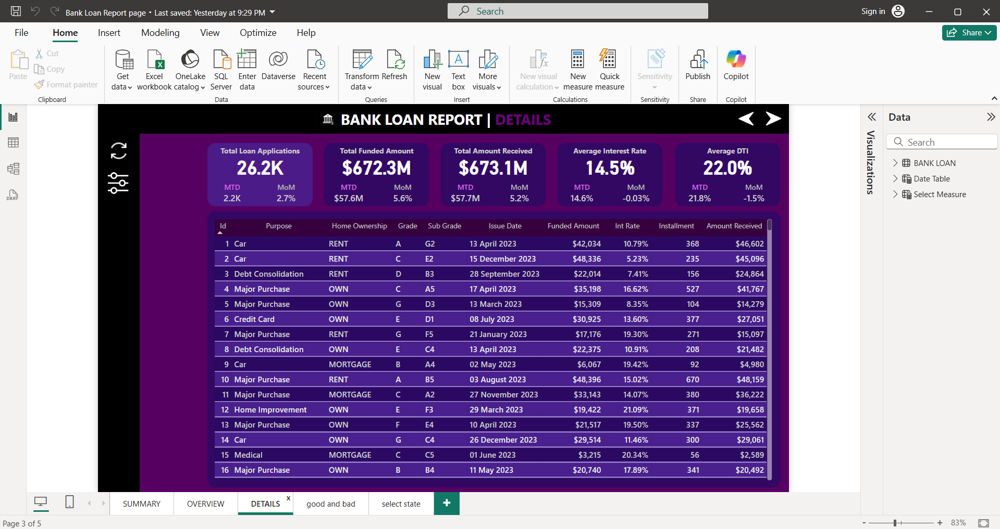

# Bank Loan Analysis

## 📌 Project Overview
 
This project aims to analyze bank loan data to gain insights into loan approval trends, risk assessment, and customer profiling. The analysis includes data cleaning, SQL queries, statistical analysis, and visualization using Power BI.

## 📂 Project Structure

1. Bank Loan Report page.pbix - Power BI dashboard for visual analysis.

2. Bank Loan data cleaning.ipynb - Jupyter Notebook for data preprocessing.

3. Bank Loan dataset.csv - Raw dataset used for analysis.

4. Bank Loan pre SQLQuery.sql - SQL queries for data extraction and transformation.

5. Bank loan work Doc.docx - Project documentation.

6. Solution1.ssmssln - SQL Server solution file.

## 📊 Tools & Technologies

- Excel - Initial data exploration.

- Python (Jupyter Notebook) - Data preprocessing and statistical analysis.

- SQL Server - Data storage and query execution.

- Power BI - Data visualization and reporting.

## 🚀 How to Run the Project

### Data Preparation:

- [x] Open Bank Loan data cleaning.ipynb in Jupyter Notebook and run the preprocessing steps.

- [x] Load Bank Loan dataset.csv into SQL Server.

- [x] Execute Bank Loan pre SQLQuery.sql to clean and transform the data.

### Analysis & Visualization:

- [x] And connect SQL Serve into Power BI Desktop in Get data.

- [x] Open Bank Loan Report page.pbix in Power BI to explore insights.

## 🛠 Built With 

          

## 🛠 Installation & Setup

### Clone the Repository

- [x] git clone https://github.com/your-username/Bank-Loan-Analysis.git

- [x] cd Bank-Loan-Analysis

### Set Up Python Environment

- [x] Install required libraries:

- pip install pandas numpy matplotlib seaborn

- Open Bank Loan data cleaning.ipynb in Jupyter Notebook and run all cells.

### SQL Database Setup

- [x] Install SQL Server.

- Import Bank Loan dataset.csv into SQL Server.

- Run Bank Loan pre SQLQuery.sql to clean and transform the data.

### Power BI Report

- [x] Install Power BI Desktop.

- Open Bank Loan Report page.pbix to explore visual insights.

## 📸 Screenshorts:

 <strong> Load & Cleanig Data </strong>

 <strong> SQL Pre-Measured </strong>

 <strong> Summary Page </strong>

  <strong> Overview Page </strong>

  <strong> Details Page </strong>

## 📢 Key Insights

- Identified key factors affecting loan approval.

- Risk segmentation based on customer profiles.

- Interactive Power BI dashboard with visual insights.

## 📬 Contact

- For any questions or collaborations, feel free to connect!

1. Linkedin-:https://www.linkedin.com/in/s-harry-antony-stephen-a4a373256/
